# Lab7Web

## Membuat PHP Dasar

PHP adalah singkatan dari PHP Hypertext Prepocessor dan merupakan bahasa
pemrograman yang di desain khusus untuk web development atau pengembangan web.
PHP memiliki sifat Server-Side karena PHP dijalankan atau di eksekusi dari sisi server.
maksud di jalankan dari sisi server adalah PHP di jalankan pada komputer server dan
bukan pada komputer client. PHP di jalankan melalui aplikasi web browser sama halnya
seperti HTML. Hampir semua situs-situs besar dan populer di kembangkan menggunakan
PHP. seperti misalnya wordpress, joomla, facebook, twitter, wikipedia dan situs besar
lainnya.

### Langkah-Langkah Praktikum

#### Install XAMPP

Unduh XAMPP dari `https://www.apachefriends.org/download.html` dan pilih versi
portable untuk memudahkan proses installasi.

#### Menjalankan Web Server
Kemudian jalankan Web Server.
Untuk menjalankan web server dari menu XAMPP Control.

#### Memulai PHP
Kemudian buat folder lab7_php_dasar pada root directory web server (E:\xampp\htdocs).
Untuk mengakses direktory tersebut pada web server dengan mengakses URL:
`http://localhost/lab7_php_dasar/`.

#### PHP Dasar
Buat file baru dengan nama `php_dasar.php` pada directory tersebut. 
Kemudian buat kode seperti berikut.

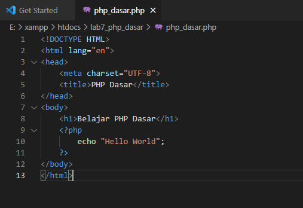

Kemudian untuk mengakses hasilnya melalui URL:
`http://localhost/lab7_php_dasar/php_dasar.php`

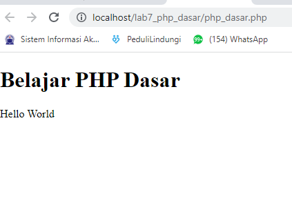

#### Variable PHP
Menambahkan variable pada program.
Masukan kode seperti berikut.

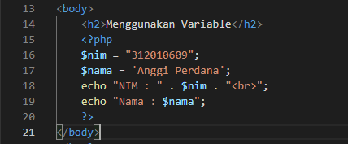

Refresh tampilan browser untuk melihat perubahannya.

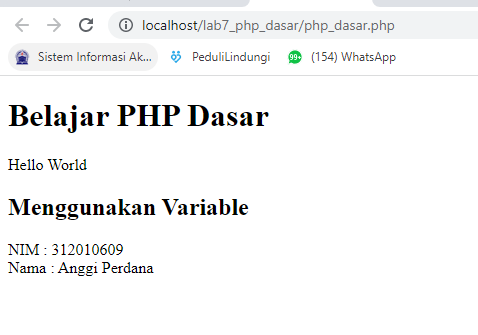

#### Predefine Variable $_GET
Buat file baru dengan nama `latihan2.php` pada directory. 
Kemudian buat kode seperti berikut.

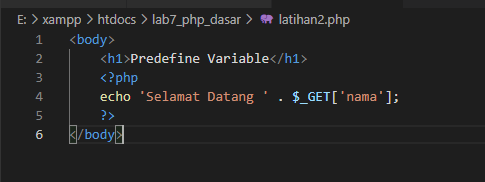

Kemudian untuk mengakses hasilnya melalui URL:
`http://localhost/lab7_php_dasar/latihan2.php?nama=Anggi`

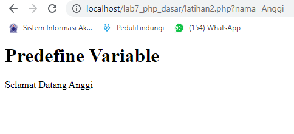

#### Membuat Form Input
Buat file baru dengan nama `form_input.php` pada directory. 
Kemudian buat kode seperti berikut.

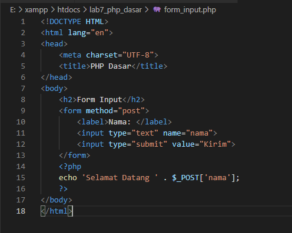

Kemudian untuk mengakses hasilnya melalui URL:
`http://localhost/lab7_php_dasar/form_input.php`

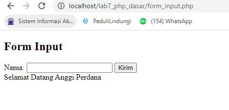

#### Pertanyaan dan Tugas
Buatlah program PHP sederhana dengan menggunakan form input yang menampilkan
nama, tanggal lahir dan pekerjaan. Kemudian tampilkan outputnya dengan menghitung
umur berdasarkan inputan tanggal lahir. Dan pilihan pekerjaan dengan gaji yang
berbeda-beda sesuai pilihan pekerjaan.

#### Membuat Form Input
Buat file baru dengan nama `form_input_tugas.php` pada directory. 
Kemudian buat kode seperti berikut.

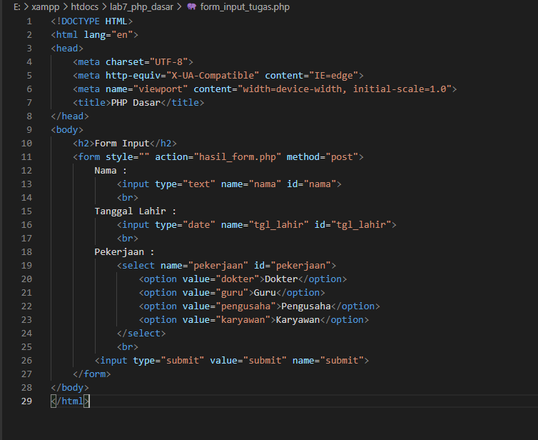

Kemudian untuk mengakses hasilnya melalui URL:
`http://localhost/lab7_php_dasar/form_input_tugas.php`

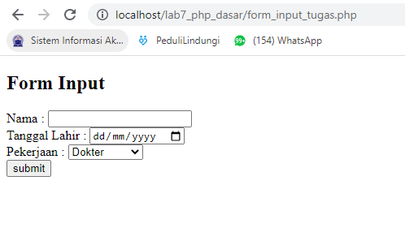

#### Membuat Hasil Input
Buat file baru dengan nama `hasil_form.php` pada directory. 
Kemudian buat kode seperti berikut.

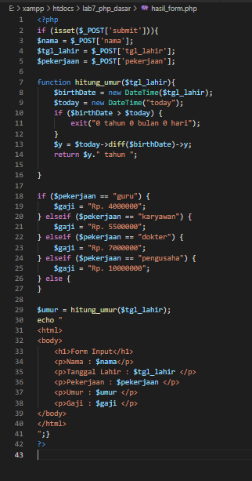

Kemudian masukan inputan pada form, contoh inputan seperti berikut.

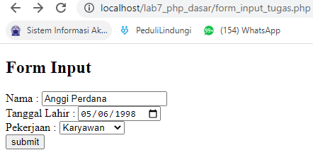

Kemudian klik `submit` untuk melihat hasilnya.

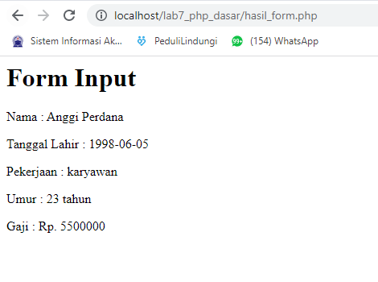

#### ~~ Demikian latihan praktikum mengenai PHP Dasar ~~
